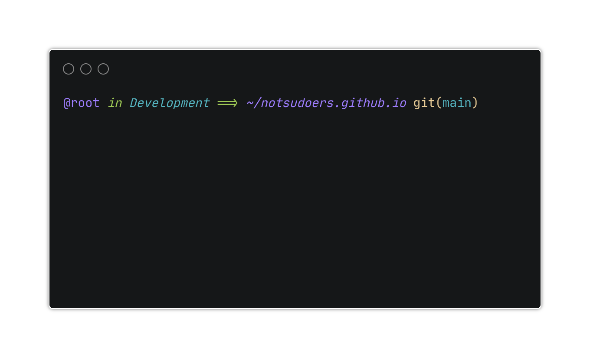
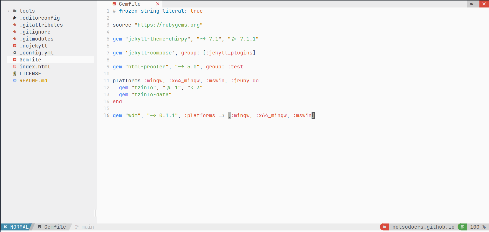
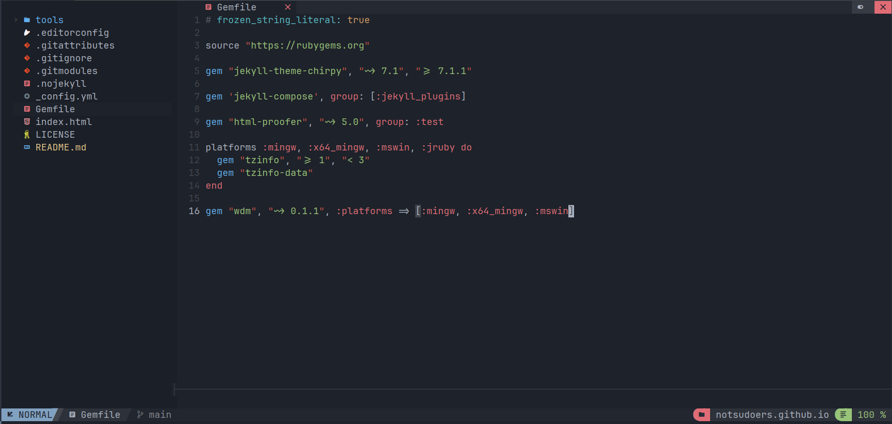
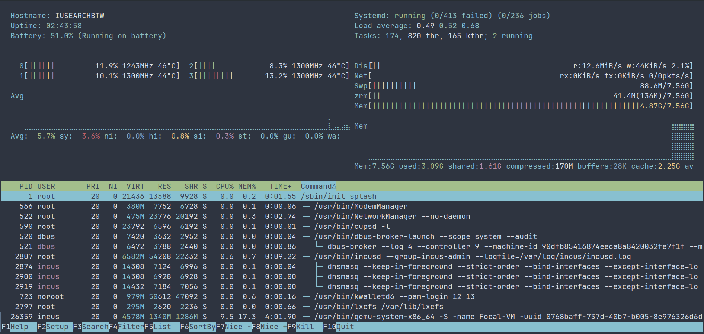

Hey everyone! Today, I want to share my personal dotfiles setup that I've crafted for a smooth and efficient workflow. If you’re diving into a new server or just looking to streamline your daily tasks, my dotfiles might just be what you need!

## What Are Dotfiles?

First off, dotfiles are configuration files for your system and applications. They’re usually hidden (with suffix dot ".") and can control everything from your shell preferences to editor settings. By customizing them, you can create a consistent and efficient environment tailored to your needs.

## Why Use My Dotfiles?

I’ve put together a collection of dotfiles that reflects my workflow, which includes:

- Terminal Customization: From bash to oh-my-posh[^footnote], I’ve tweaked my prompt to be informative yet clean.
- Editor Settings: My preferred configurations for NeoVim using NvChad[^footnote2].
- System Preferences: A few personal touches that enhance daily tasks.
  - ssh client config
  - inputrc to enable [Tab] complete using bash
  - beautiful htoprc
  - yet another yogurt (yay) package manager for arch based distro

## Let's get started

### Install necessary packages

#### For Arch Based

<details markdown="1">
<summary>Show</summary>

```sh
sudo pacman -Syy && \
sudo pacman -S --noconfirm base-devel git wget curl unzip npm bash-completion \
ripgrep python-virtualenv lm_sensors fontconfig && \
git clone https://aur.archlinux.org/yay.git && \
cd yay && \
makepkg -si --noconfirm && \
cd
```

</details>

#### For Debian Based

<details markdown="1">
<summary>Show</summary>

```sh
curl -fsSL https://deb.nodesource.com/setup_lts.x -o nodesource_setup.sh && \
sudo bash nodesource_setup.sh && \
sudo apt install -y git wget curl unzip nodejs bash-completion ripgrep python3-venv \
libncursesw5-dev autotools-dev autoconf automake build-essential libcap-dev libsensors-dev
```

</details>

#### For RHEL Based

<details markdown="1">
<summary>Show</summary>

```sh
sudo dnf update -y && \
sudo dnf install -y epel-release && \
curl -fsSL https://rpm.nodesource.com/setup_lts.x -o nodesource_setup.sh && \
sudo bash nodesource_setup.sh && \
sudo dnf install -y git wget curl tar unzip fontconfig nodejs bash-completion ripgrep python3-virtualenv \
ncurses-devel automake autoconf gcc libcap-devel lm_sensors-devel --skip-broken
```

</details>

#### For BSD Based System

<details markdown="1">
<summary>Show</summary>

```sh
pkg update && \
pkg install -y bash bash-completion bash-completion-freebsd \
git neovim npm-node20 ripgrep py311-virtualenv fontconfig automake ncurses gcc autotools autoconf
```

</details>

### Install neovim

```sh
curl -LO https://github.com/neovim/neovim/releases/latest/download/nvim-linux64.tar.gz && \
sudo tar -C /opt -xzf nvim-linux64.tar.gz
```

### Install oh-my-posh

```sh
sudo wget https://github.com/JanDeDobbeleer/oh-my-posh/releases/latest/download/posh-linux-amd64 -O /usr/local/bin/oh-my-posh && \
sudo chmod +x /usr/local/bin/oh-my-posh
```

<details markdown="1">
<summary>For BSD</summary>

```sh
fetch https://github.com/JanDeDobbeleer/oh-my-posh/releases/latest/download/posh-freebsd-amd64 -o /usr/local/bin/oh-my-posh && \
chmod +x /usr/local/bin/oh-my-posh
```

</details>

### Install htop

```sh
wget https://github.com/htop-dev/htop/releases/download/3.3.0/htop-3.3.0.tar.xz &&\
tar xvf htop-3.3.0.tar.xz &&\
cd htop-3.3.0 &&\
./autogen.sh &&\
./configure --enable-sensors --enable-capabilities --prefix=/usr &&\
make -j`nproc` &&\
sudo make install &&
cd
```

<details markdown="1">
<summary>For BSD</summary>

```sh
fetch https://github.com/htop-dev/htop/releases/download/3.3.0/htop-3.3.0.tar.xz &&\
tar xvf htop-3.3.0.tar.xz &&\
cd htop-3.3.0 &&\
./autogen.sh &&\
./configure --enable-unicode --prefix=/usr &&\
make -j`nproc` &&\
make install &&
cd
```

</details>

### Configure Dotfiles

#### Clone this repository

```sh
git clone https://gitlab.com/notsudoers/my-dotfiles.git &&\
cd my-dotfiles
```

#### Symlink all configuration to the home directory

```sh
ln -s $(pwd)/.gitconfig $HOME/.gitconfig
ln -s $(pwd)/.poshthemes $HOME/.poshthemes
ln -s $(pwd)/.inputrc $HOME/.inputrc
ln -s $(pwd)/.bash_profile $HOME/.bash_profile
ln -s $(pwd)/.fonts $HOME/.fonts
mkdir -p $HOME/{.config,.ssh}
ln -s $(pwd)/.config/* $HOME/.config/
ln -s $(pwd)/.ssh/config $HOME/.ssh/config
```

#### Add necessary value to the .bashrc

```sh
echo -e 'export PATH="$PATH:/opt/nvim-linux64/bin"' >> $HOME/.bashrc
echo -e 'eval "$(oh-my-posh init bash --config ~/.poshthemes/huvix.omp.yaml)" \nalias cl="clear"' >> $HOME/.bashrc
```

<details markdown="1">
<summary>For BSD</summary>

```sh
cd
fetch https://gist.githubusercontent.com/notsudoers/574e5da0a1396dc4d727d823c8087046/raw/2826f0c7aae15e13f05e41006ad1b266ef14fa25/.bashrc
echo -e '\neval "$(oh-my-posh init bash --config ~/.poshthemes/huvix.omp.yaml)"' >> $HOME/.bashrc
pw usermod $USER -s $(which bash)
```

</details>

#### Refresh font cache

```sh
fc-cache -f -v
```

#### Load new configuration

```sh
. ~/.bashrc
```

#### Init neovim configuration first to installing all plugins stuff

```sh
nvim
```

> Run `:Lazy sync` command to update to the latest plugins

> Run `:MasonInstallAll` command after lazy.nvim finishes downloading plugins.

> Apply the `JetBrainsMono Nerd Font Mono` as your default font in terminal app.

> Lastly change the value of git in `~/.gitconfig` to fit your settings.

## Final look

### Oh-my-posh on git repository

{: .light }
{: .dark }

### Neovim

{: .light .shadow }
{: .dark .shadow }

### Htop

{: .light .shadow }
{: .dark .shadow }

## Conclusion

Dotfiles can really level up your productivity and help you maintain a consistent environment across devices. I hope you find my setup useful!

Feel free to explore, adapt, and share your own dotfiles as well. Let’s make our workflows as efficient as possible!

## Reference

[^footnote]: [Oh My Posh main site](https://ohmyposh.dev/)

[^footnote2]: [NvChad main site](https://nvchad.com/)
