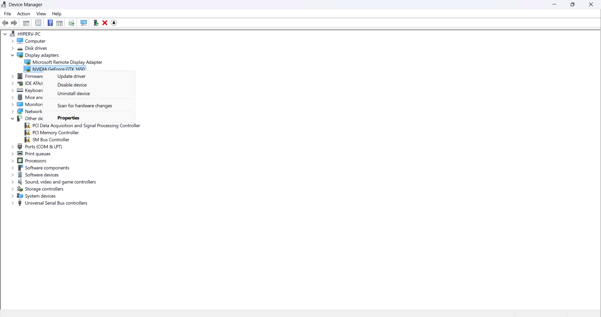
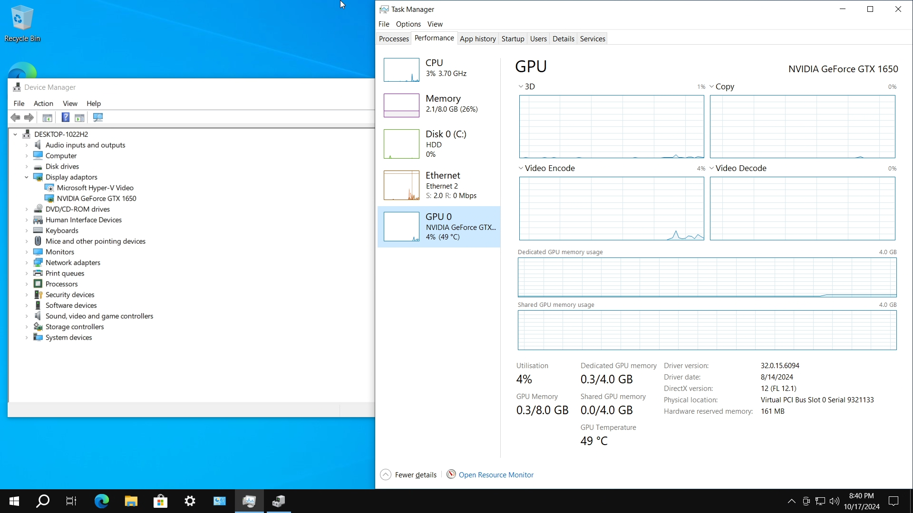
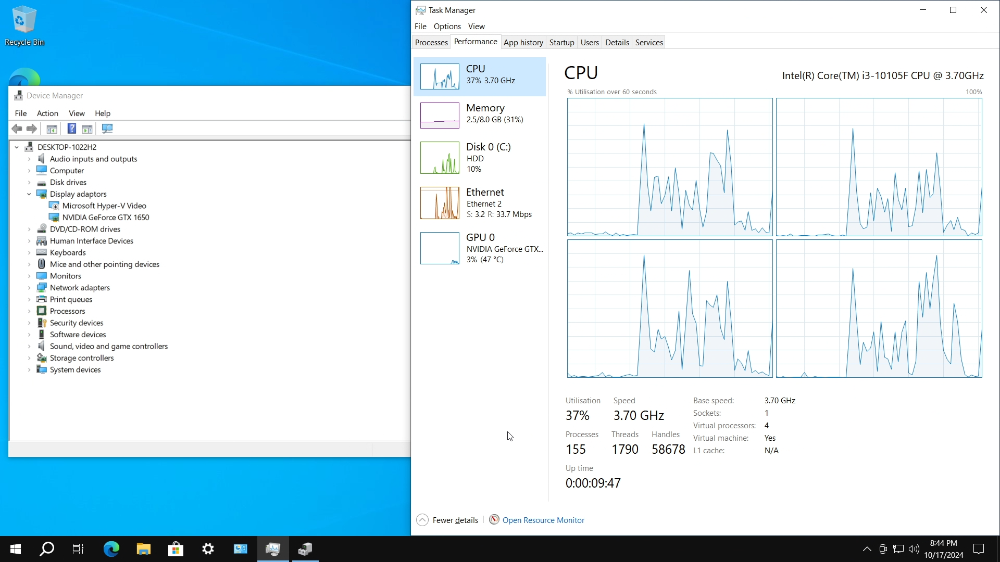
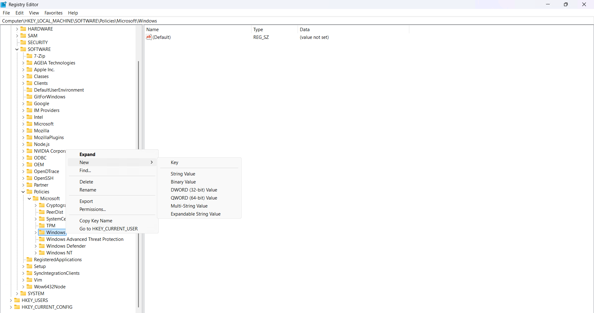
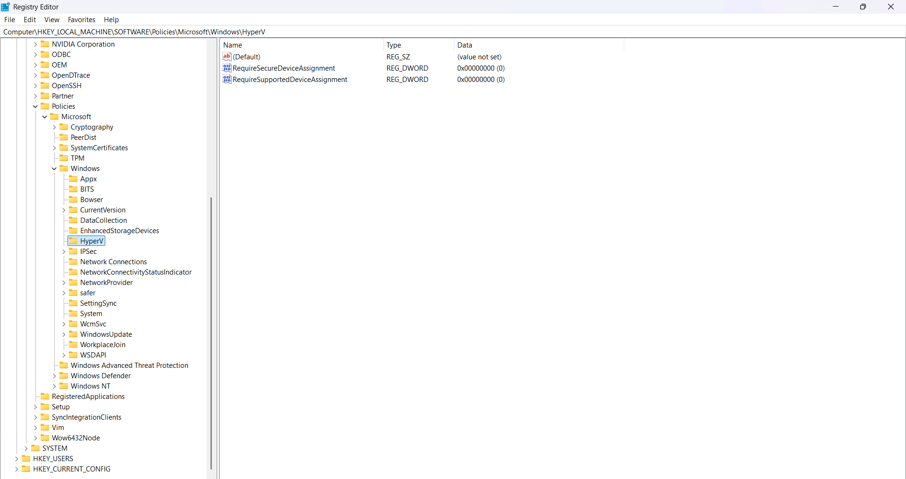
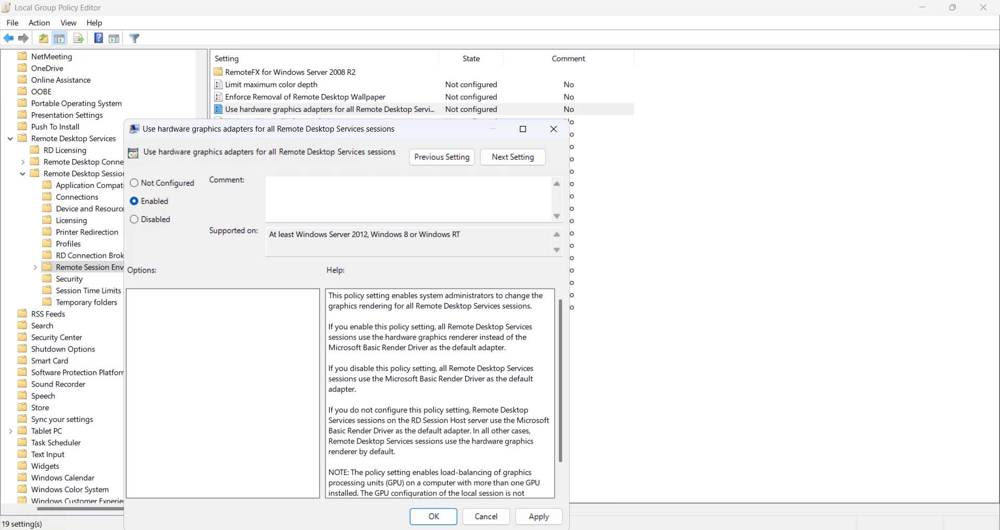

In the world of virtualization, Hyper-V stands out as a powerful tool for running multiple operating systems on a single physical machine. One of the most exciting features for tech enthusiasts and professionals alike is GPU PCI passthrough. This functionality allows virtual machines (VMs) to leverage the full power of dedicated GPUs, enhancing graphics performance and unlocking new use cases for virtualization. In this article, we’ll delve into what GPU passthrough is, how it works in Hyper-V, and its practical applications.

## What is GPU PCI Passthrough?

GPU PCI passthrough is a technique that allows a virtual machine to access a dedicated graphics card directly, bypassing the host operating system. This means the VM can use the GPU for rendering graphics, processing complex calculations, or running graphically intensive applications. This is particularly beneficial for workloads such as gaming, 3D rendering, and machine learning.

## Why Use GPU Passthrough in Hyper-V?

1. Enhanced Performance: By giving a VM direct access to a physical GPU, you can significantly boost its performance for graphics-intensive tasks.
2. Improved Resource Utilization: Organizations can maximize hardware usage by assigning GPUs to specific VMs based on demand.
3. Versatility: Whether for gaming, simulation, or development, GPU passthrough opens up new possibilities in virtualized environments.

## Prerequisites

- Enable I/O MMU and Hardware Acceleration in Bios (Intel VT-d or AMD-V)
- Enable Hyper-V Features

## Step to Configure GPU PCI Passthrough

### Enable Discrete Device Assignment (DDA)

- Ensure your VM is powered off.
- Disable GPU from Device Manager:

  - Right click Windows Logo -> Device Manager -> Expand Display adapters -> Right click your GPU and click Disable device

    {: .shadow }
    _Device Manager_

- Run the powershell command below as Administrator:

  - Describe your VM name:

    ```powershell
    $vm = "yourvmname"
    ```

  - Set automatic stop action to TurnOff

    ```powershell
    Set-VM -Name $vm -AutomaticStopAction TurnOff
    ```

  - Enable Write-Combining on the CPU

    ```powershell
    Set-VM -GuestControlledCacheTypes $true -VMName $vm
    ```

  - Configure 32 bit MMIO space

    ```powershell
    Set-VM -LowMemoryMappedIoSpace 3Gb -VMName $vm
    ```

  - Configure Greater than 32 bit MMIO space

    ```powershell
    Set-VM -HighMemoryMappedIoSpace 33280Mb -VMName $vm
    ```

  - Find the Location Path and disable the Device

    In this example i've used my NVIDIA GPU, you can change with your GPU manufactures name

    ```powershell
    $pnpdevs = Get-PnpDevice -presentOnly
    $gpudevs = $pnpdevs | Where-Object {$_.Class -like "Display" -and $_.Manufacturer -like "NVIDIA"}
    $locationPath = ($gpudevs | Get-PnpDeviceProperty DEVPKEY_Device_LocationPaths).data[0]
    Disable-PnpDevice -InstanceId $gpudevs[0].InstanceId
    ```

  - Dismount the Device from the Host

    ```powershell
    Dismount-VMHostAssignableDevice -Force -LocationPath $locationPath
    ```

  - Assign the device to the guest VM

    ```powershell
    Add-VMAssignableDevice -LocationPath $locationPath -VMName $vm
    ```

  - Verify if the device attached successfully

    ```powershell
    Get-VMAssignableDevice -VMName $vm
    ```

- Power on your VM and install the GPU drivers as usual

- If you want to detached GPU from VM and bring back to the Hyper-V host use command below:

  - Make sure VM powered off

  ```powershell
  Remove-VMAssignableDevice -LocationPath $locationPath -VMName $vm
  Mount-VMHostAssignableDevice -LocationPath $locationPath
  ```

## Final look

{: .shadow }
{: .shadow }
_Inside Hyper-V Windows Virtual Machine_

## Troubleshoot

### If you see an error like “The operation failed because the object was not found” or Error 12

- Right click Windows Logo -> Run and type "regedit"
- On Registry Editor paste the following path:

  `Computer\HKEY_LOCAL_MACHINE\SOFTWARE\Policies\Microsoft\Windows\HyperV`

- If HyperV folder not found, just create like this:

  `Computer\HKEY_LOCAL_MACHINE\SOFTWARE\Policies\Microsoft\Windows`

  - Right click on Windows folder -> New -> Key and type "HyperV"

  {: .shadow }
  _Registry Editor: Create HyperV Folder_

- Inside HyperV folder create the following "DWORD (32-bit)" with value is 0

  - `RequireSecureDeviceAssignment`

  - `RequireSupportedDeviceAssignment`

  {: .shadow }
  _Registry Editor: Create Dword Value_

## Tips

### Force GPU to rendering Remote Desktop connection

- Right click Windows Logo -> Run and type "gpedit.msc"
- On Local Group Policy Editor, navigate to Computer Configuration -> Administrator Templates -> Windows Components -> Remote Desktop Services -> Remote Desktop Session Host -> Remote Session Environment -> Use hardware graphics adapters for all Remote Desktop Services sessions
- Set value to **Enabled**

  {: .shadow }
  _Local Group Policy Editor_

## Conclusion

GPU passthrough in Hyper-V is a powerful feature that unlocks the full potential of graphics-intensive applications within virtual environments. By following the steps outlined above, you can significantly enhance the performance of your virtual machines, providing a better experience for users in demanding workloads. As virtualization continues to grow, leveraging technologies like GPU passthrough will be essential for maintaining high performance and efficiency in your IT infrastructure.

## Reference

- [Deploy graphics devices by using Discrete Device Assignment](https://learn.microsoft.com/en-us/windows-server/virtualization/hyper-v/deploy/deploying-graphics-devices-using-dda)
- [Hyper-V GPU Passthrough: An Essential Guide for Beginners
  ](https://www.nakivo.com/blog/hyper-v-gpu-passthrough)
